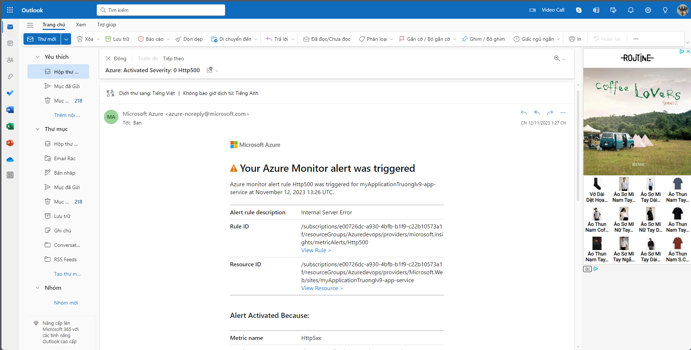

# Overview

Udacity final project Ensuring Quality Releases

# Project Structure 

- **azure-pipelines.yaml**: Azure pipelines yaml
- **automatedtesting**: Suites of different tests
  - **jmeter**: Load test (JMeterPlan.jmx), CSV inputs, and TestReports (endurance-report, stress-report)
  - **postman**: Functional tests postman collections and environments
  - **selenium**: Ui tests (uitests.py)
- **screenshoots**: All screen shots requests
- **terraform**: Terraform scripts
---

## Environment Creation & Deployment

- Terraform to apply Infrastructure as Code (IaC)
  - Screenshots of the log output of Terraform when executed by the CI/CD pipeline
   
   
   
   

- Automated testing tasks
  - Screenshot of the successful execution of the pipeline build results page (/_build/results?buildId={id}&view=results)
    

## Automated Testing

- Load test suite 
  - Screenshot of the log output of JMeter when executed by the CI/CD pipeline
    
    
  
- Functional test suites 
  - Screenshot of the execution of the test suite by the CI/CD pipeline
   

- API-integration tests
  - Screenshot of the output of the Publish Test Results step
    
  - Screenshot of the Run Summary page (which contains 4 graphs)
    
  - Screenshot of the Test Results page (which contains the test case titles from each test) 
    

## Monitoring & Observability

- Configure Azure Monitor
  - Screenshots of the graphs of the resource that the alert was triggered
    
  - Screenshots of the alert rule
    
  - Screenshots of the email received when the alert is triggered
    

    Note: if you udacity account lab, when run terraform apply in pipeline very long time because resourec group locked you need unlock follow step in local:

    `$ terraform init`
    `$ terraform import modules.resource_group.azurerm_resource_group.test /subscriptions/subscriptionid/resourceGroups/AzureDevops` 
